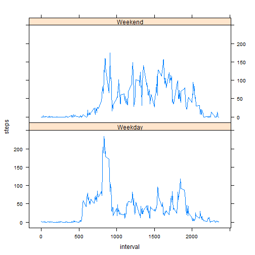

This markdown file is my personal submission for the course project in Week 2 of the "Reproducible Research" course of the Johns Hopkins Data Science Track. Enjoy!

## Loading and Preprocessing data
As the title indicates, we need to bring in our dataset. You'll need to have the file in your working directory
for this script to work on your machine


```r
activity <- read.csv("activity.csv" , header = TRUE)
```

## What is mean total number of steps taken per day?

We will first aggregate the steps taken per day, removing NA values in the process. The code chunk below accomplishes this

```r
agg_activity <- aggregate(activity$steps, by = list(activity$date), FUN = sum, na.rm = TRUE)
names(agg_activity) <- c("date", "steps")
```

We can then illustrate the frequency of steps per day with the following histogram

```r
with(agg_activity, hist(steps, main = "Steps Per Day"))
```


The last part is the calculation of mean and median steps per day

```r
meanactivity <- round(mean(agg_activity$steps), digits = 0)
medianactivity <- median(agg_activity$steps)
```

Using the code chunk above, we learn that the mean number of steps per day is 9354 and the median is 10395

## What is the average daily activity type pattern?

This requires a different type of aggregation, we will instead see the activity pattern by interval.

```r
agg_time <- aggregate(activity$steps, by = list(activity$interval), FUN = mean, na.rm = TRUE)
names(agg_time) <- c("interval", "steps")
```

Once the aggregation is complete we can plot the result

```r
with(agg_time, plot(interval, steps, type = "l", ylab = "Avg. Steps", xlab= "Time Interval"))
```


Based on the graph it appears that the most active interval is somewhere the 800 mark, but we can find out exactly using the following code chunk...

```r
maxvalue <- agg_time[which.max(agg_time$steps),]
print(maxvalue)
```

```
##     interval    steps
## 104      835 206.1698
```

## Inputting missing values

The first thing we'd like to do is count the amount of NA values, we can do that with:

```r
sum_na <- sum(is.na(activity$steps))
print(sum_na)
```

```
## [1] 2304
```

Secondly, we will replace all NA values with the mean step count for those interval with a proper record.
We will store this in a new dataset named newagg_activity

```r
new_activity <- transform(activity, steps = ifelse(is.na(steps), mean(steps, na.rm = TRUE), steps))
newagg_activity <- aggregate(new_activity$steps, by = list(new_activity$date), FUN = sum, na.rm = TRUE)
names(newagg_activity) <- c("date", "steps")
```

Using this revised dataset, we can plot a histogram of these values

```r
with(newagg_activity, hist(steps, main = "Steps Per Day"))
```


```r
new_meanactivity <- round(mean(newagg_activity$steps), digits = 1)
new_medianactivity <- median(newagg_activity$steps)
print(new_meanactivity)
```

```
## [1] 10766.2
```

```r
print(new_medianactivity)
```

```
## [1] 10766.19
```
Using the code chunk above, we learn that the mean and median number of steps per day is the same. By replacing the NA values with the mean, we add more weight to the mean value and reduce the standard deviation.

## Are there differences in activity patterns between weekdays and weekends?

This first requires the classification of our existing data into "Weekends" and "Weekdays", which can be accomplished using the following function.

```r
activity$date <- as.Date(activity$date, format = "%Y-%m-%d")
activity$week <- ifelse(weekdays(activity$date) %in% c("Saturday","Sunday"),"Weekend","Weekday")
weekdayagg <- aggregate(activity$steps, by = list(activity$interval,activity$week), FUN = mean, na.rm = TRUE)
names(weekdayagg) <- c("interval","week","steps")
```

Following the above chunk, we can easily plot the Weekdays and Weekends side by side. The differences tell us that on the Weekends, the user is more likely to exercise at various times throughout the day. This stands in contrast with the Weekdays, where there is a clear preference for the beggining and late afternoons.

```r
#Create a grid for the individual charts
library(lattice)
xyplot(steps ~ interval | week, data = weekdayagg, type="l",layout = c(1,2))
```



